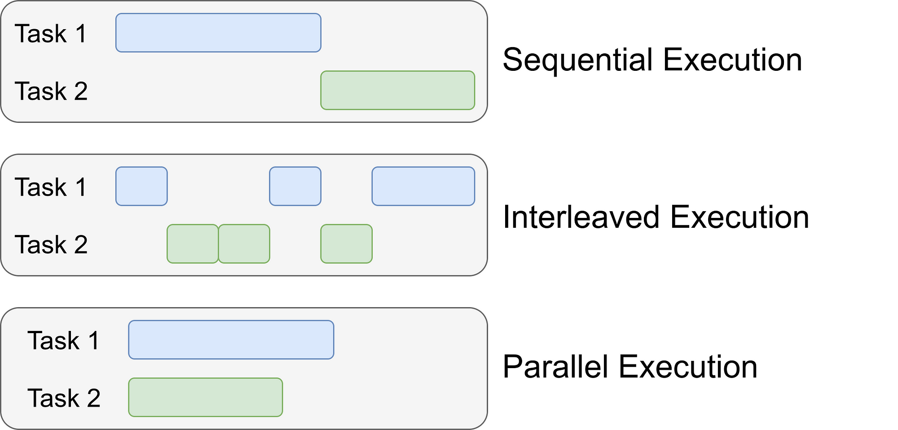
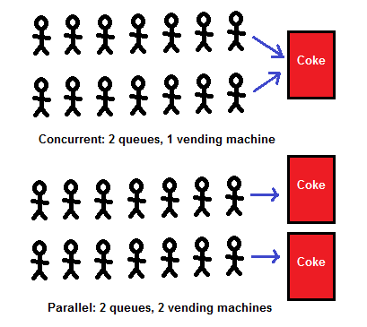

## Concurrency


**Concurrency** means that two or more calculations happen within the same time  
frame. **Parallelism** means that two or more calculations happen at the same  
moment. Parallelism is therefore a specific case of concurrency. It requires  
multiple CPU units or cores.  



[Concurrency vs parallelism](https://www.youtube.com/watch?v=RlM9AfWf1WU)

## Terms 

The meanings of the following terms *overlap*.  

- *Multitasking* is the ability of a program to handle multiple tasks  
  **apparently** at the same time.  
- *Parallel programming* is true parallel execution of tasks by utilizing  
  multiple cores on a CPU.  
- *Asynchronous programming* is non-blocking execution of tasks on a single  
  thread.
- *Multithreading* allows a single program to appear to execute multiple tasks  
  concurrently. It achieves this by creating multiple threads, which are  
  lightweight sub-processes that run within a single Java process.  

The term *concurrent programming* is usually used for both *async* and  
*parallel* programming.    



## Parallel programming

Simultaneous execution of multiple tasks. It utilizes multiple cores for true    
multitasking. It is ideal for CPU-bound operations. It achieves maximum    
performance by dividing work.    
  
  
* *Focus on true parallelism:* Unlike multitasking (which can involve  
  multithreading but doesn't guarantee parallel execution), parallel programming  
  specifically targets dividing tasks into independent units that can run  
  simultaneously on multiple cores.  
* *Multiple cores required:* This approach leverages the hardware capabilities  
  of modern CPUs that have multiple cores. Each core can execute a separate  
  thread, enabling genuine parallel processing.   
* *Independent tasks are key:*  For effective parallel programming, the tasks  
  need to be independent and not rely on shared data. This avoids the need for  
  complex synchronization mechanisms that can slow down parallel execution.  
  
Benefits of Parallel Programming:  
  
* *Significant performance gains:* By utilizing multiple cores, parallel  
  programming can significantly improve the speed of certain tasks that can be  
  effectively broken down into independent units. This is especially beneficial  
  for CPU-bound tasks with high computational demands.  
* *Improved scalability:* Parallel programs can potentially scale well with  
  increasing numbers of cores, allowing them to handle larger workloads more  
  efficiently.  
  
Challenges of Parallel Programming:  
  
* *Not all tasks are parallelizable:*  Not all programming problems can be  
  easily divided into independent tasks. Some tasks might have inherent  
  dependencies that make parallelization difficult or inefficient.  
* *Overhead of managing parallelism:*  There can be overhead associated with  
  dividing tasks, scheduling them on different cores, and potentially combining  
  results. This overhead needs to be considered to ensure the benefits outweigh  
  the costs.  
  
Common approaches for Parallel Programming in Java:  
  
* *Fork/Join Framework:* This Java library provides tools for decomposing  
  tasks into subtasks and executing them recursively on multiple threads.  
* *Java Streams:*  Streams offer parallel processing capabilities for certain  
  operations on collections.  If the data can be processed independently,  
  streams can leverage multiple cores for improved performance.  


## Multithreading

Multithreading in Java is a powerful technique that allows a single program to  
appear to execute multiple tasks concurrently. It achieves this by creating  
multiple threads, which are lightweight sub-processes that run within a single  
Java process.  

Here's a breakdown of key concepts:  

* *Threads:* These are the building blocks of multithreading. They are  
  independent units of execution within a program that share the process's  
  resources like memory and open files.  
* *Context Switching:* The operating system rapidly switches between threads,  
  giving the illusion of simultaneous execution. However, at any given moment,  
  only one thread is truly executing on a CPU core.  
* *Concurrency vs Parallelism:* Multithreading enables concurrency, which is  
  the ability to handle multiple tasks apparently at the same time. It doesn't  
  guarantee true parallelism, which means tasks genuinely running simultaneously  
  on multiple cores.  This depends on the available CPU cores and the operating  
  system's scheduling.   

Benefits of Multithreading:  
  
* *Improved responsiveness:* The user interface remains usable even while  
  long-running tasks are happening in the background.  
* *Efficient resource utilization:* Multiple threads can keep the CPU busy,  
  potentially improving performance for CPU-bound tasks that can be broken down  
  into independent units.  
* *Background processing:* Long-running tasks can be offloaded to separate  
  threads, preventing them from blocking the main thread.  
  
*Things to Consider with Multithreading:*  
  
* *Complexity:* Managing multiple threads can introduce complexity due to  
  synchronization needs. Improper synchronization can lead to concurrency issues  
  like race conditions.  
* *Overhead:*  Context switching between threads has some overhead, which can  
  negate performance benefits for tasks with frequent context switches.  


## Async programming

Non-blocking execution of tasks. It executes tasks concurrently on a single  
thread. It is used for I/O-bound operations.  

Asynchronous programming focuses on keeping the main thread responsive, not  
necessarily on true parallel execution. It can leverage multithreading with  
context switching for tasks that benefit from multiple cores. It can also be  
achieved in single-threaded models for I/O-bound tasks using event loops or  
non-blocking libraries.

Here's a breakdown of how async programming can be implemented:

Using Multithreading with Context Switching:

* This is a common approach. The long-running operation is executed in a  
  separate thread while the main thread continues. The operating system manages  
  context switching between threads, allowing them to seemingly run  
  concurrently.  
* This leverages the benefits of multiple cores to potentially improve  
  performance for CPU-bound tasks.  
* However, managing multiple threads can introduce complexity and overhead due  
  to context switching.  

Without Multithreading (Single-threaded approach):

* Here, asynchronous programming relies on mechanisms like event loops or  
  non-blocking I/O libraries.  
* The main thread doesn't create separate threads but keeps track of ongoing  
  operations.  
* When an operation needs to wait for an external event (like network data or  
  disk access), the main thread can delegate the waiting to the underlying  
  library and continue processing other tasks.  
* This approach is simpler and avoids context switching overhead, but it might  
  not fully utilize multiple cores for CPU-bound tasks.  


Common uses of asynchronous programming in Java:

- Network requests (fetching data from a server)
- File I/O (reading or writing data to a file)
- Database operations
- Long-running calculations


## Process vs thread

A Java process is like a whole program running on its own, with its own space  
and resources. Threads are lighter parts within a process that can seemingly run  
at once, sharing the program's resources and needing care to avoid conflicts.  

| Aspect                                      | Process                               | Thread                               |
|---------------------------------------------|---------------------------------------|--------------------------------------|
| Memory Isolation (Separate Memory)          | Processes run in separate memory      | Threads share memory                  |
| Memory Usage                                | Uses more memory                      | Uses less memory                      |
| Zombie Processes                            | Children can become zombies            | No zombies possible                   |
| Overhead                                    | More overhead                         | Less overhead                         |
| Creation and Destruction Speed              | Slower to create and destroy          | Faster to create and destroy          |
| Coding and Debugging Complexity             | Easier to code and debug              | Can become harder to code and debug   |

Table: Process vs Thread


## Thread.sleep

The `Thread.sleep` method suspends the execution of the current thread for a  
specified duration. When a thread sleeps, it temporarily stops running, giving  
other threads a chance to execute.

```java
package com.zetcode;

class Task implements Runnable {

    private int delay;
    private String name;

    public Task(String name, int delay) {

        this.name = name;
        this.delay = delay;
    }

    @Override
    public void run() {

        try {

            System.out.println("starting task: " + name);

            Thread.sleep(delay);
            System.out.printf("finishing task %s%n", this.name);
        } catch (InterruptedException e) {
            e.printStackTrace();
        }
    }
}

public class SleepEx {

    public static void main(String[] args) {

        var task1 = new Task("Task/2000", 2000);
        var t1 = new Thread(task1);
        t1.start();

        var task2 = new Task("Task/1000", 1000);
        var t2 = new Thread(task2);
        t2.start();

        var task3 = new Task("Task/500", 500);
        var t3 = new Thread(task3);
        t3.start();

        System.out.println("tasks launched");
    }
}
```

## Thread join

The `join` method is provided by the `Thread` class and allows one thread to  
wait for the completion of another thread.    

When we call `t.join()` on a thread object `t`, the current thread (the one   
calling join) pauses its execution and enters a waiting state. The waiting state  
continues until the target thread `t` finishes its execution. Once `t`  
terminates, the current thread resumes its execution from where it left off  
before the join call.  

```java
package com.zetcode;

class Worker extends Thread {

    private int delay;
    private String msg;

    public Worker(int delay, String msg) {

        this.delay = delay;
        this.msg = msg;
    }

    public void run() {

        try {
            Thread.sleep(delay);
        } catch (InterruptedException e) {
            e.printStackTrace();
        }
        System.out.println(msg);
    }
}

public class JoinEx {

    public static void main(String[] args) {

        var w1 = new Worker(2000, "Hello there");
        var w2 = new Worker(1000, "New mail received");
        var w3 = new Worker(500, "Notes taken");

        // start three threads
        w1.start();
        w2.start();
        w3.start();

        // wait for threads to end
        try {

            // join is a blocker method which waits for a thread to complete.

            // the w1.join() causes the current (main) thread to pause execution
            // until w1's thread terminates.
            w1.join();
            w2.join();
            w3.join();

        } catch (InterruptedException e) {

            e.printStackTrace();
        }

        System.out.println("doing main tasks");
        System.out.println("finished tasks");
    }
}
```

## Synchronization Tools in Java

The following table  provides a brief overview of common synchronization tools.
Each tool has its own specific functionalities and use cases.

| Tool | Description | Use Cases |
|---|---|---|
| *synchronized* | Keyword that ensures only one thread can access a code block or method at a time. | Thread-safety for methods or critical sections of code. |
| *volatile* | Modifier that ensures immediate visibility of changes made to a variable by one thread to other threads. | Making primitive variables thread-visible for basic operations (doesn't guarantee atomicity). |
| *AtomicInteger/AtomicLong/ etc.* | Classes offering atomic operations (get, set, increment, decrement) on primitive data types. | Thread-safe updates on single variables (counters, flags). |
| *ReentrantLock* | Manually controlled lock object. Threads acquire and release the lock explicitly. | Fine-grained control over synchronization, useful for complex synchronization scenarios. |
| *Semaphore* | Controls access to a limited number of resources. Only a specified number of threads can acquire the semaphore at a time. | Managing access to a pool of resources, preventing resource exhaustion. |
| *CountDownLatch* | Signals all waiting threads when a counter reaches zero. | Coordinating thread completion, waiting for a specific number of tasks to finish. |
| *CyclicBarrier* | Awaits a fixed number of threads to reach a barrier point before all threads proceed. | Coordinating thread execution, ensuring all threads reach a specific point before continuing. |
| *Phaser* | A more flexible barrier that allows threads to register and unregister dynamically.  | Coordinating phases of concurrent tasks with dynamic participation. |
| *BlockingQueue* | A queue that blocks threads attempting to enqueue or dequeue elements when the queue is full/empty. | Thread-safe producer-consumer queues for data exchange between threads. |
| *ConcurrentHashMap/ etc.* | Concurrent collections specifically designed for thread-safe access. | Thread-safe data structures for storing and manipulating collections. |


## AtomicLong

`AtomicLong` provides a long variable that can be read and written atomically.  
It ensures that operations on the variable are thread-safe, preventing issues  
like lost updates in concurrent environments.  

`AtomicLong` is a class  within the `java.util.concurrent.atomic`  
package that provides an atomic and thread-safe way to represent and manipulate  
a long primitive data type.   

`AtomicLong` can be considered a synchronization primitive. It provides atomic  
operations for long values, ensuring thread-safe access and modification. Unlike  
traditional locks, which can introduce performance overhead, AtomicLong  
leverages low-level atomic instructions to maintain data consistency without  
blocking threads. Its primary purpose is to handle concurrent updates  
efficiently while avoiding race conditions.  


Key characteristics:  
  
* *Atomic operations:*  `AtomicLong` guarantees that read and write operations  
  on the underlying long value are atomic. This means an operation appears to be  
  executed as a single, indivisible unit, even if multiple threads are trying to  
  access the value concurrently. This prevents inconsistencies and data races  
  that can occur with regular long variables in a multithreaded environment.  
* *Thread-safety:*  By ensuring atomic operations, `AtomicLong` makes it safe  
  to use the same long value across multiple threads without the need for  
  explicit synchronization mechanisms like locks. This simplifies thread-safe  
  programming and reduces the risk of concurrency issues.  
* *Common operations:*  The class provides various methods for atomically  
  performing operations on the long value, such as getting the current value,  
  setting a new value, incrementing/decrementing the value, and comparing and  
  swapping the value.  
  
Benefits of using AtomicLong:
  
* *Prevents data races:*  Guaranteeing atomic operations avoids  
  inconsistencies that can arise when multiple threads try to read or write the  
  same long value simultaneously.  
* *Simplifies concurrent programming:* Eliminates the need for complex  
  synchronization code in scenarios where multiple threads access a long  
  variable.  
* *Improved performance:*  Atomic operations can sometimes be more efficient  
  than using locks, especially for frequentl
  accessed variables.  
  
Use cases for AtomicLong:  
  
* *Counters:*  `AtomicLong` is ideal for representing counters that are  
  incremented or decremented by multiple threads in a concurrent environment  
  (e.g., counting website visitors, tracking active network connections).  
* *Sequence numbers:*  It can be used to generate unique and atomically  
  incremented sequence numbers, useful for various purposes like logging or  
  transaction IDs.  
* *Flags:*  AtomicLong can be used as a simple flag variable that multiple  
  threads can set or reset atomically, indicating a specific state or condition.  


```java
package com.zetcode;

import java.util.concurrent.atomic.AtomicLong;

class Counter {

    private final AtomicLong counter = new AtomicLong(0);

    public void inc() {

        counter.getAndIncrement();
    }

    public long get() {

        return counter.get();
    }
}

public class AtomicLongEx {

    public static void main(String[] args) throws InterruptedException {

        final Counter counter = new Counter();

        // 500 threads
        for (int i = 0; i < 500; i++) {

            var thread = new Thread(() -> counter.inc());

            thread.start();
        }

        // sleep three seconds
        Thread.sleep(3000);

        System.out.println("Value: " + counter.get());
    }
}
```

## Task button

The example shows how the background task interferes with the main application  
thread if not put on a separate thread.  

```java
package com.zetcode;

import javax.swing.GroupLayout;
import javax.swing.JButton;
import javax.swing.JComponent;
import javax.swing.JFrame;
import javax.swing.SwingWorker;
import java.awt.EventQueue;

class MyWorker extends SwingWorker<Void, Void> {

    @Override
    protected Void doInBackground() throws Exception {
        // Simulate a time-consuming task
        Thread.sleep(3000);
        return null;
    }

    @Override
    protected void done() {
        System.out.println("task done");
    }
}

public class ButtonTaskEx extends JFrame {

    public ButtonTaskEx() {

        initUI();
    }

    private void initUI() {

        var taskButton = new JButton("Task");

//        taskButton.addActionListener((event) -> {
//            var worker = new MyWorker();
//            worker.execute();
//        });


        taskButton.addActionListener((event) -> {
            try {
                Thread.sleep(3000);
                System.out.println("task done");
            } catch (InterruptedException e) {
                throw new RuntimeException(e);
            }
        });

        createLayout(taskButton);

        setTitle("Task button");
        setSize(500, 450);
        setLocationRelativeTo(null);
        setDefaultCloseOperation(EXIT_ON_CLOSE);
    }

    private void createLayout(JComponent... arg) {

        var pane = getContentPane();
        var gl = new GroupLayout(pane);
        pane.setLayout(gl);

        gl.setAutoCreateContainerGaps(true);

        gl.setHorizontalGroup(gl.createSequentialGroup()
                .addComponent(arg[0])
        );

        gl.setVerticalGroup(gl.createSequentialGroup()
                .addComponent(arg[0])
        );
    }

    public static void main(String[] args) {

        EventQueue.invokeLater(() -> {

            var ex = new ButtonTaskEx();
            ex.setVisible(true);
        });
    }
}
```


## Searching for files 

The purpose of this program is to initiate a background search for various image  
files in a user’s home directory.  

`SwingWorker` manages background tasks, `doInBackground` handles the actual  
work, `publish` sends data to the EDT (Event-Dispatch Thread), and `process`  
updates the GUI based on that data.  


```java
package com.zetcode;

import javax.swing.AbstractAction;
import javax.swing.GroupLayout;
import javax.swing.JButton;
import javax.swing.JComponent;
import javax.swing.JFrame;
import javax.swing.JLabel;
import javax.swing.JScrollPane;
import javax.swing.JTextArea;
import javax.swing.SwingWorker;
import java.awt.Container;
import java.awt.EventQueue;
import java.awt.event.ActionEvent;
import java.io.IOException;
import java.nio.file.FileSystems;
import java.nio.file.FileVisitResult;
import java.nio.file.FileVisitor;
import java.nio.file.Files;
import java.nio.file.Path;
import java.nio.file.PathMatcher;
import java.nio.file.Paths;
import java.nio.file.attribute.BasicFileAttributes;
import java.util.List;

import static javax.swing.GroupLayout.Alignment.BASELINE;
import static javax.swing.GroupLayout.Alignment.CENTER;

/*
 * This program initiates a background search for
 * various image files in a user's home directory.
 */

public class SearchingImagesEx extends JFrame {

    private JTextArea area;
    private JLabel lbl;
    private JButton btn;

    public SearchingImagesEx() {

        initUI();
    }

    private void initUI() {

        area = new JTextArea(20, 40);
        area.setEditable(false);
        var scrollPane = new JScrollPane(area);

        btn = new JButton("Start");
        btn.addActionListener(new StartSearchAction());

        lbl = new JLabel("Files found: ");

        createLayout(scrollPane, btn, lbl);

        setTitle("Searching for files");
        setLocationRelativeTo(null);
        setDefaultCloseOperation(JFrame.EXIT_ON_CLOSE);
    }

    private void createLayout(JComponent... arg) {

        Container pane = getContentPane();
        GroupLayout gl = new GroupLayout(pane);
        pane.setLayout(gl);

        gl.setAutoCreateContainerGaps(true);
        gl.setAutoCreateGaps(true);

        gl.setHorizontalGroup(gl.createParallelGroup(CENTER)
                .addComponent(arg[0])
                .addGroup(gl.createSequentialGroup()
                        .addComponent(arg[1])
                        .addComponent(arg[2]))
        );

        gl.setVerticalGroup(gl.createSequentialGroup()
                .addComponent(arg[0])
                .addGroup(gl.createParallelGroup(BASELINE)
                        .addComponent(arg[1])
                        .addComponent(arg[2]))
        );

        pack();
    }

    private class StartSearchAction extends AbstractAction {

        @Override
        public void actionPerformed(ActionEvent e) {

            doStartSearch();
        }

        private void doStartSearch() {

            btn.setEnabled(false);

            var tw = new FileTreeWalker();
            tw.execute();
        }
    }

    public static void main(String[] args) {

        EventQueue.invokeLater(() -> {
            var ex = new SearchingImagesEx();
            ex.setVisible(true);
        });
    }

    private class FileTreeWalker extends SwingWorker<Void, Path>
            implements FileVisitor<Path> {

        private final PathMatcher matcher;
        private int count = 0;

        public FileTreeWalker() {

            var str = "glob:**.{png,PNG,gif,GIF,jpg,jpeg,JPG,JPEG}";
            matcher = FileSystems.getDefault().getPathMatcher(str);
        }

        @Override
        protected Void doInBackground() throws IOException {

            Path path = Paths.get(System.getProperty("user.home"));
            Files.walkFileTree(path, this);
            return null;
        }

        @Override
        protected void process(List<Path> chunks) {

            for (Path path : chunks) {

                area.append(path.toString() + "\n");
                count++;

                lbl.setText(String.format("Files found: %d", count));
            }
        }

        @Override
        protected void done() {

            btn.setEnabled(true);
        }

        @Override
        public FileVisitResult preVisitDirectory(Path dir, BasicFileAttributes attrs){

            return FileVisitResult.CONTINUE;
        }

        @Override
        public FileVisitResult visitFile(Path file, BasicFileAttributes attrs)  {

            if (matcher.matches(file)) {

                publish(file);
            }

            return FileVisitResult.CONTINUE;
        }

        @Override
        public FileVisitResult visitFileFailed(Path file, IOException exc) {

            return FileVisitResult.CONTINUE;
        }

        @Override
        public FileVisitResult postVisitDirectory(Path dir, IOException exc) {

            return FileVisitResult.CONTINUE;
        }
    }
}
```

## Sequential requests 

```java
package com.zetcode;

import java.net.URI;
import java.net.http.HttpClient;
import java.net.http.HttpRequest;
import java.net.http.HttpResponse;
import java.time.Duration;
import java.util.List;
import java.util.stream.Stream;

public class SequentialRequestsEx {

    public static void main(String[] args) {
        List<URI> uris = Stream.of(
                "https://www.google.com/",
                "https://clojure.org",
                "https://www.rust-lang.org",
                "https://golang.org",
                "https://www.python.org",
                "https://code.visualstudio.com",
                "https://ifconfig.me",
                "http://termbin.com",
                "https://www.github.com/"
        ).map(URI::create).toList();

        try (HttpClient httpClient = HttpClient.newBuilder()
                .connectTimeout(Duration.ofSeconds(10))
                .followRedirects(HttpClient.Redirect.ALWAYS)
                .build()) {

            for (URI uri : uris) {
                verifyUri(httpClient, uri);
            }
        }
    }

    private static void verifyUri(HttpClient httpClient, URI uri) {
        HttpRequest request = HttpRequest.newBuilder()
                .timeout(Duration.ofSeconds(5))
                .uri(uri)
                .build();

        try {
            HttpResponse<Void> response = httpClient.send(request, HttpResponse.BodyHandlers.discarding());
            if (response.statusCode() == 200) {
                System.out.printf("[SUCCESS] Verified %s%n", uri);
            } else {
                System.out.printf("[FAILURE] Failed to verify %s%n", uri);
            }
        } catch (Exception e) {
            System.out.printf("[FAILURE] Exception while verifying %s: %s%n", uri, e.getMessage());
        }
    }
}
```


## Async requests

Asynchronous requests with `CompletableFuture`.  

```java
package com.zetcode;

import java.net.URI;
import java.net.http.HttpClient;
import java.net.http.HttpRequest;
import java.net.http.HttpResponse;
import java.time.Duration;
import java.util.List;
import java.util.concurrent.CompletableFuture;
import java.util.stream.Stream;

public class StatusAsync {

    public static void main(String[] args) {

        List<URI> uris = Stream.of(
                "https://www.google.com/",
                "https://clojure.org",
                "https://www.rust-lang.org",
                "https://golang.org",
                "https://www.python.org",
                "https://code.visualstudio.com",
                "https://ifconfig.me",
                "http://termbin.com",
                "https://www.github.com/"
        ).map(URI::create).toList();

        try (HttpClient httpClient = HttpClient.newBuilder()
                .connectTimeout(Duration.ofSeconds(10))
                .followRedirects(HttpClient.Redirect.ALWAYS)
                .build()) {

            var futures = uris.stream()
                    .map(uri -> verifyUri(httpClient, uri))
                    .toArray(CompletableFuture[]::new);

            CompletableFuture.allOf(futures).join();
        }
    }

    private static CompletableFuture<Void> verifyUri(HttpClient httpClient,
                                                     URI uri) {
        HttpRequest request = HttpRequest.newBuilder()
                .timeout(Duration.ofSeconds(5))
                .uri(uri)
                .build();

        return httpClient.sendAsync(request, HttpResponse.BodyHandlers.discarding())
                .thenApply(HttpResponse::statusCode)
                .thenApply(statusCode -> statusCode == 200)
                .exceptionally(ex -> false)
                .thenAccept(valid -> {
                    if (valid) {
                        System.out.printf("[SUCCESS] Verified %s%n", uri);
                    } else {
                        System.out.printf("[FAILURE] Failed to verify%s%n", uri);
                    }
                });
    }
}
```
